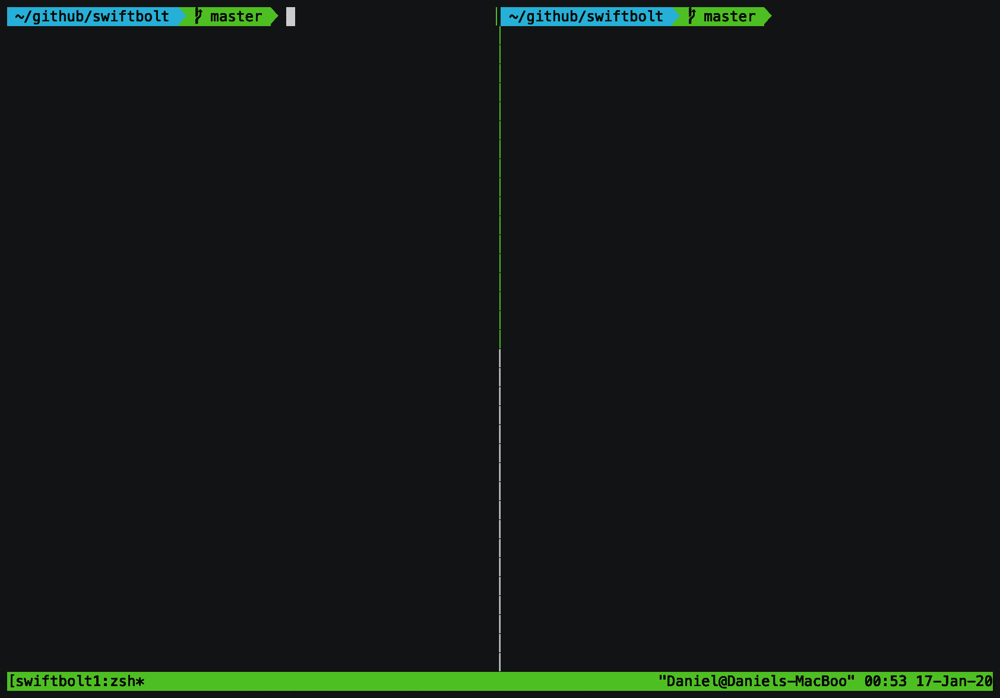

# swiftbolt
A janky [compiler explorer](http://godbolt.org) for Swift. The real compiler explorer doesn't support code execution for Swift.

# Example

Type
```
./run
```
and then edit `Sources/swiftbolt/main.swift`. The output of `main.swift` is displayed and periodically refreshed.



# Other kinds of output

| Command | Output                                          |
|---------|-------------------------------------------------|
| run     | Execute program.                                |
| ast     | Generate the abstract syntax tree.              |
| ir      | Generate llvm ir.                               |
| oir     | Generate optimized llvm ir.                     |
| sil     | Generate Swift intermediate language.           |
| osil    | Generate optimized Swift intermediate language. |
